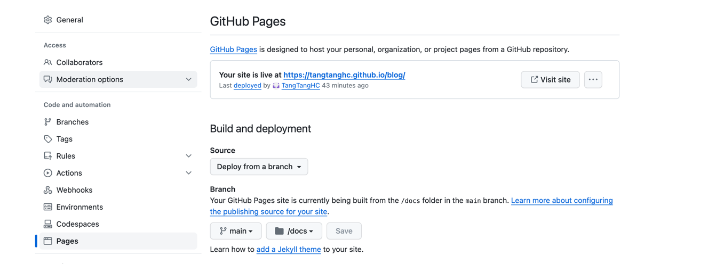

# 博客搭建
docsify文档：https://docsify.js.org/#/zh-cn/
## docsify下载安装
**安装**
```shell
npm i docsify-cli -g
```
**初始化，官方推荐使用docs**
```shell
docsify init docs
```
**初始化成功，生成两个文件**
- index.html: 入口文件 
- README.md: 首页的内容
**本地预览**
```shell
docsify serve docs
```
**配置导航页**
> 参考 https://docsify.js.org/#/zh-cn/more-pages
## 配置github
1. 新建项目
2. docs同级目录，上传文件到git
3. setting->Pages

4. 访问 https://tangtanghc.github.io/blog/, 完活
## 配置gitee
还没研究，等等吧……


